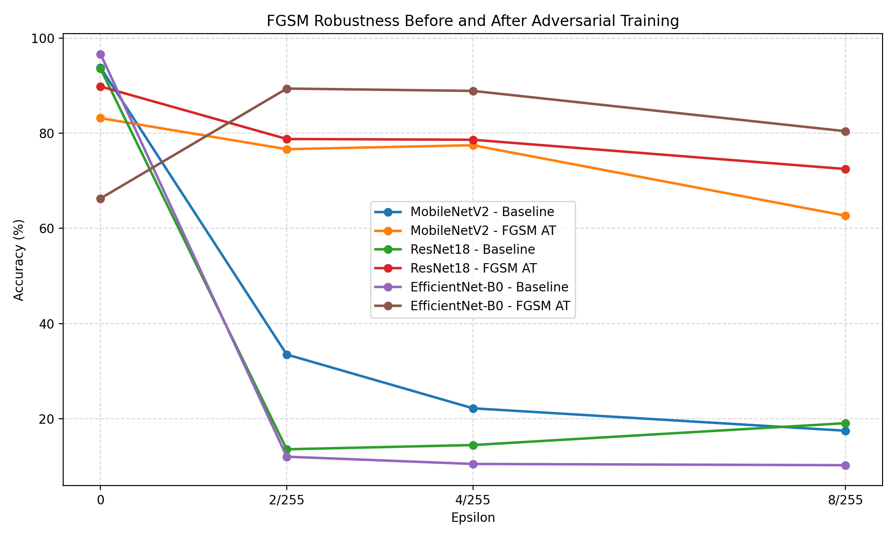

# Adversarial ML Project

This project experiments with FGSM attacks and FGSM Adversarial Training on the CIFAR-10 dataset using pretrained models from `torchvision`.

## Project Contents

- `01_MobileNet_FGSM_AT.ipynb`: MobileNetV2 + FGSM + FGSM Adversarial Training.
- `02_ResNet_FGSM_AT.ipynb`: ResNet18 + FGSM + FGSM Adversarial Training.
- `03_VggNet_FGSM_AT.ipynb`: VGG16 + FGSM + FGSM Adversarial Training.
- `04_EfficientNet_FGSM_AT.ipynb`: EfficientNet-B0 + FGSM + FGSM Adversarial Training.
- `requirements.txt`: required Python packages.
- `data/`: CIFAR-10 dataset directory, ignored by git.

Each notebook follows the same main workflow:

1. Load CIFAR-10.
2. Resize images to `224x224`.
3. Load an ImageNet-pretrained model.
4. Replace the classification head with a 10-class output layer.
5. Fine-tune the model on clean data.
6. Evaluate robustness against FGSM attacks.
7. Train the model again using FGSM adversarial training.
8. Evaluate the robust model and plot the comparison.

## Environment Requirements

This project uses PyTorch and should be run with a GPU if possible. The current `requirements.txt` targets CUDA 11.8:

```txt
torch==2.7.1+cu118
torchvision==0.22.1+cu118
torchaudio==2.7.1+cu118
```

If your local machine does not use CUDA 11.8, install the correct PyTorch build for your GPU or CPU from the official PyTorch installation guide, then install the remaining packages from `requirements.txt`.

## Option 1: Run Locally

### 1. Create a virtual environment

Using Conda:

```bash
conda create -n advml python=3.11
conda activate advml
```

Or using `venv`:

```bash
python -m venv .venv
.venv\Scripts\activate
```

### 2. Install dependencies

If your machine supports CUDA 11.8:

```bash
pip install -r requirements.txt
```

If installing `torch==...+cu118` fails, install PyTorch separately for your own machine first, then install the remaining packages:

```bash
pip install numpy pandas matplotlib scikit-learn tqdm ipykernel jupyter pillow opencv-python
```

### 3. Start Jupyter Notebook

```bash
jupyter notebook
```

Then open and run the notebooks:

```txt
01_MobileNet_FGSM_AT.ipynb
02_ResNet_FGSM_AT.ipynb
03_VggNet_FGSM_AT.ipynb
04_EfficientNet_FGSM_AT.ipynb
```

The MobileNet, ResNet, and VGG notebooks use:

```python
root='./data'
download=True
```

so CIFAR-10 will be downloaded into the `data/` directory if it is not already available.

### Local Notes

- A GPU is recommended. Running everything on CPU will be very slow.
- VGG16 is much heavier than the other models and may run out of GPU memory. If you get an out-of-memory error, reduce `batch_size` from `64` to `32`, `16`, or `8`.
- `test_loader` currently uses `batch_size=1`, so FGSM evaluation can be slow.
- Checkpoint `.pth` files are saved to the current working directory when the notebook uses relative paths.

## Option 2: Run on Google Colab

### 1. Upload the project to Google Drive

Upload the full project folder to Google Drive, for example:

```txt
MyDrive/Adversarial_ML_Project/
```

Recommended structure:

```txt
Adversarial_ML_Project/
  01_MobileNet_FGSM_AT.ipynb
  02_ResNet_FGSM_AT.ipynb
  03_VggNet_FGSM_AT.ipynb
  04_EfficientNet_FGSM_AT.ipynb
  requirements.txt
  data/
```

### 2. Enable GPU in Colab

In Colab:

```txt
Runtime -> Change runtime type -> Hardware accelerator -> GPU
```

### 3. Mount Google Drive

Add this cell at the beginning of the notebook if it is not already there:

```python
from google.colab import drive
drive.mount('/content/drive')
```

Move into the project directory:

```python
%cd /content/drive/MyDrive/Adversarial_ML_Project
```

### 4. Install dependencies on Colab

Colab usually already includes PyTorch. In most cases, you only need the extra packages:

```python
!pip install numpy pandas matplotlib scikit-learn tqdm pillow opencv-python
```

If you want to install from `requirements.txt`, check Colab's CUDA and PyTorch versions first, because the PyTorch version in `requirements.txt` may not match the current Colab runtime.

### 5. Configure the dataset path

To keep the dataset inside the project folder:

```python
root = './data'
download = True
```

To keep the dataset in a separate Drive folder:

```python
root = '/content/drive/MyDrive/datasets'
download = False
```

When using `download=False`, the CIFAR-10 files must already exist in that directory.

### 6. Save model checkpoints to Google Drive

When running on Colab, save checkpoints to Google Drive so they are not lost when the runtime disconnects:

```python
torch.save(model.state_dict(), "/content/drive/MyDrive/models/model_name.pth")
```

Create the folder first if needed:

```python
!mkdir -p /content/drive/MyDrive/models
```

## Note About VGG16

`03_VggNet_FGSM_AT.ipynb` uses VGG16, which is memory-heavy when CIFAR-10 images are resized to `224x224`. If it fails due to GPU memory limits:

- Reduce `batch_size` in `train_loader`.
- Try running it on a Colab GPU with more VRAM.
- Run the workflow in stages: train the clean model, save the checkpoint, restart the runtime, then continue with adversarial training.

## Expected Outputs

Each notebook produces:

- Accuracy on the clean test set.
- Accuracy under FGSM attack with epsilons `0`, `2/255`, `4/255`, and `8/255`.
- Accuracy after FGSM adversarial training.
- A plot comparing the baseline model and the FGSM adversarially trained model.
- A `.pth` checkpoint file if the model-saving cell is executed.

## Experimental Results

The final comparison uses three baseline models: MobileNetV2, ResNet18, and EfficientNet-B0. Each model was evaluated before and after FGSM Adversarial Training using the same CIFAR-10 test set and the same FGSM epsilon values.

| Model | Status | epsilon = 0 | epsilon = 2/255 | epsilon = 4/255 | epsilon = 8/255 |
|---|---|---:|---:|---:|---:|
| MobileNetV2 | Baseline | 93.78% | 33.51% | 22.22% | 17.51% |
| MobileNetV2 | FGSM AT | 83.15% | 76.63% | 77.46% | 62.67% |
| ResNet18 | Baseline | 93.52% | 13.61% | 14.50% | 19.09% |
| ResNet18 | FGSM AT | 89.79% | 78.77% | 78.61% | 72.47% |
| EfficientNet-B0 | Baseline | 96.61% | 12.05% | 10.53% | 10.27% |
| EfficientNet-B0 | FGSM AT | 66.29% | 89.36% | 88.87% | 80.41% |



The results show that all three pretrained models achieve high accuracy on clean CIFAR-10 data, but their accuracy drops sharply under FGSM attacks. After FGSM Adversarial Training, adversarial accuracy improves significantly across all models, especially at `epsilon = 8/255`. ResNet18 provides the most balanced result because it keeps relatively high clean accuracy while improving robustness under attack. EfficientNet-B0 achieves the highest adversarial accuracy after defense, but it also has the largest drop on clean data.
